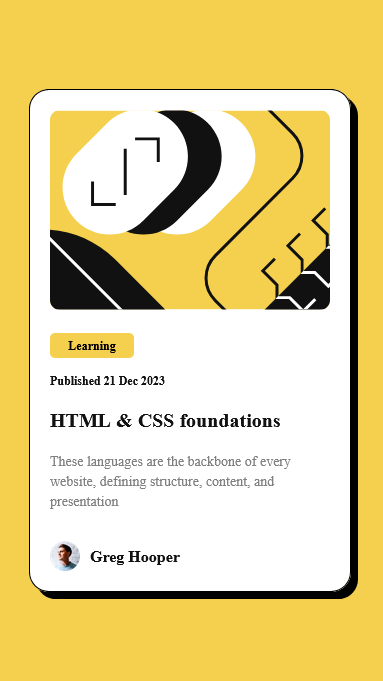

## Table of contents

- [Overview](#overview)
  - [Screenshot](#screenshot)
- [My process](#my-process)
  - [Built with](#built-with)
  - [What I learned](#what-i-learned)
  - [Useful resources](#useful-resources)
- [Author](#author)

## Overview

### Screenshot

    

        
        windows screenshot1
    

    

        
        mobile screenshot
    

## My process

### Built with

- Semantic HTML5 markup
- CSS custom properties
- Flexbox
- Mobile-first workflow

### What I learned

-Flexbox
-Stroing color values in variable with @root 
-Importing fonts with @fontface
-add ":active" state using css to change color when clicked

### Useful resources

- [OpenAI](https://www.openai.com) 
- [Codepen](https://www.codepen.io) - This is an amazing website which helped me practice and test different ideas. With this website I don't have to worry about HTML templates. I can start by only writing necessary tags without worrying about standart HTML layout. That's really helpful for quick testing. I'd recommend it to anyone still learning HTML, CSS and JS.

## Author

- Frontend Mentor - [@booirng](https://www.frontendmentor.io/profile/boooring)

